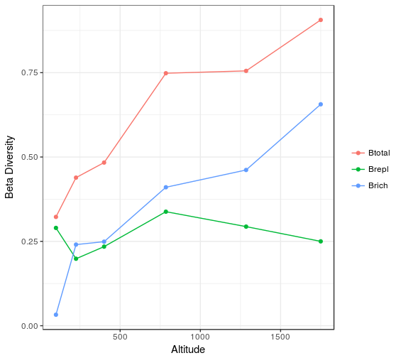

# divalt
*Marco Girardello* (marco.girardello@gmail.com) 

An R package for analysing species diversity patterns along elevational gradients. This package is meant to provide a collection of useful functions for the analyses of elevational diversity patterns.

The package can be installed by typing:

```r
# the devtools package is needed to be able to load the package
# install.packages("devtools")
library(devtools)
install_github("marcog77/divalt")
library(divalt)
``` 
# Example usage
What follows is some simple examples of how this package can be used to analyse elevational diversity patterns. All the examples below make use
of the publicly available dataset published in John T. Longino and Robert K. Colwell. 2011. Density compensation, species composition, and richness of ants on a neotropical elevational gradient. Ecosphere 2:art29.

## Required Packages

```{r packages, message=FALSE}
library(reshape);library(rangemodelR);
library(betapart)
# for plotting
library(ggplot2)
```


## Partionining of beta diversity between elevational bands
The functions `betacar()` `betabas()` calculate beta diversity between altitudinal bands starting from a community data matrix, following the methods implemented in Carvalho et al. (2012) and Baselga et al. (2010). These functions can be applied to a dataframe containing data from one of more elevational gradients. `betacar()` partitions beta diversity into its richness and replacement components, whereas `betabas()` partitions beta diversity into its replacement and nestedness components. 

Example using the ant data from Longino & Colwell (2011):

```r
#' Partition beta diversity into richhness and replacement components (Carvalho et al. 2012)
#'@indat=name of dataframe containing species incidence data 
#'@alt=character vector indicating column name for altitude values
#'@group=character vector indicating column name containing IDs 
#'for the elevational gradients (if there more than one gradient)

beta1<-betacar(indat=longino11,alt="Elevation")

# Extract results of computations from slot 1
beta1[[1]]

     Btotal     Brepl     Brich  Altitude Altitude.midpoint
1 0.9062500 0.2500000 0.6562500 1500-2000              1750
2 0.7552448 0.2937063 0.4615385 1070-1500              1285
3 0.7482759 0.3379310 0.4103448  500-1070               785
4 0.4835165 0.2344322 0.2490842   300-500               400
5 0.4389313 0.1984733 0.2404580   150-300               225
6 0.3224638 0.2898551 0.0326087    50-150               100

# Extract plot of results from slot 2 
beta1[[2]]


``` 



```r
#' Partition beta diversity into nestedness and replacement components (Baselga et al. 2010)
#'@indat=name of dataframe containing species incidence data 
#'@alt=character vector indicating column name for altitude values
#'@group=character vector indicating column name containing IDs 
#'for the elevational gradients (if there more than one gradient)


beta2<-betabas(indat=longino11,alt="Elevation")

# Extract results of computations from slot 1
beta2[[1]]

     Btotal     Brepl     Bnest  Altitude Altitude.midpoint
1 0.9062500 0.7272727 0.1789773 1500-2000              1750
2 0.7552448 0.5454545 0.2097902 1070-1500              1285
3 0.7482759 0.5730994 0.1751764  500-1070               785
4 0.4835165 0.3121951 0.1713214   300-500               400
5 0.4389313 0.2613065 0.1776248   150-300               225
6 0.3224638 0.2996255 0.0228383    50-150               100

# Extract plot of results from slot 2 
beta2[[2]]

``` 


## Whittaker's species turnover
The function `betaw()` calculates the  Whittaker's species turnover starting from a community data matrix following the
method descrived in Whittaker (1960).

## Mid-domain effect
The function `midalt()` provides a test of the mid-domain effect hypothesis following the methods of Colwell & Lees (2000).

## Rapoport's rule 
The function `rapalt()` calculates species ranges and create in order to provide a test of the Rapoport's rule (Rapoport 1982) .

## Distance-decay in beta diversity
The function `decalt()` calculates distance decay relationship "between altidude and beta diversity components", following the
methods of 


References


