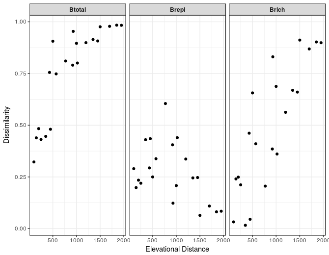

# divalt
*Marco Girardello* (marco.girardello@gmail.com) 

An R package for analysing species diversity patterns along elevational gradients. This package is meant to provide a collection of self-written functions for the analyses of elevational diversity patterns.

The package can be installed by typing:

```r
# the devtools package is needed to be able to load the package
# install.packages("devtools")
library(devtools)
install_github("marcog77/divalt")
library(divalt)
``` 
# Example usage
What follows is some simple examples of how this package can be used to analyse elevational diversity patterns. All the examples below make use
of the publicly available dataset published in John T. Longino and Robert K. Colwell. 2011. Density compensation, species composition, and richness of ants on a neotropical elevational gradient. Ecosphere 2:art29.

## Required Packages

```{r packages, message=FALSE}
library(reshape);library(rangemodelR);
library(betapart);library(dplyr);library(simba);
# for plotting
library(ggplot2)
```


## Partitioning of beta diversity 
The functions `betacar()` `betabas()` partition beta diversity calculated by comparing successive elevational bands (between altitude beta diversity). The methods used are those implemented in Carvalho et al. (2012) and Baselga et al. (2010). These functions can be applied to a dataframe containing data on one or more elevational gradients. `betacar()` partitions beta diversity into its richness and replacement components (Carvalho et al. 2012), whereas `betabas()` partitions beta diversity into its replacement and nestedness components (Baselga et al. 2010). 

Example using the ant data from Longino & Colwell (2011):

```r
#' Partition beta diversity into richhness and replacement components (Carvalho et al. 2012)
#'@indat=name of dataframe containing species incidence data 
#'@alt=character vector indicating column name for altitude values
#'@group=character vector indicating column name for elevational gradient IDs 
#'(if there is more than one study area)

beta1<-betacar(indat=longino11,alt="Elevation")

# Extract results of computations from slot 1
beta1[[1]]

     Btotal     Brepl     Brich  Altitude Altitude.midpoint
1 0.9062500 0.2500000 0.6562500 1500-2000              1750
2 0.7552448 0.2937063 0.4615385 1070-1500              1285
3 0.7482759 0.3379310 0.4103448  500-1070               785
4 0.4835165 0.2344322 0.2490842   300-500               400
5 0.4389313 0.1984733 0.2404580   150-300               225
6 0.3224638 0.2898551 0.0326087    50-150               100

# Extract plot of results from slot 2 
beta1[[2]]


``` 


```r
#' Partition beta diversity into nestedness and replacement components (Baselga et al. 2010)
#'@indat=name of dataframe containing species incidence data 
#'@alt=character vector indicating column name for altitude values
#'@group=character vector indicating column name for elevational gradient IDs 
#'(if there is more than one study area)

beta2<-betabas(indat=longino11,alt="Elevation")

# Extract results of computations from slot 1
beta2[[1]]

     Btotal     Brepl     Bnest  Altitude Altitude.midpoint
1 0.9062500 0.7272727 0.1789773 1500-2000              1750
2 0.7552448 0.5454545 0.2097902 1070-1500              1285
3 0.7482759 0.5730994 0.1751764  500-1070               785
4 0.4835165 0.3121951 0.1713214   300-500               400
5 0.4389313 0.2613065 0.1776248   150-300               225
6 0.3224638 0.2996255 0.0228383    50-150               100

# Extract plot of results from slot 2 
beta2[[2]]

``` 


## Whittaker's species turnover
The function `betaw()` calculates the  Whittaker's species turnover starting from a community data matrix following the
method descrived in Whittaker (1960). This function only works if multiple samples were taken across each elevational band.
See example dataset for data structure. 

```r
#' @ indat = matrix containing community data
#' @ alt = character vector indicating column name for altitude values
#' @ group =character vector indicating column name for elevational gradient IDs 
#' (if there is more than one stuy area)
#' @ sname =character vector  indicating column name for sample IDs (i.e. samples 
#' collected within each elevational band)

betawres<-betaw(indat=longino11a,alt="Elevation",sname="sample")

# Extract results of computations from slot 1
head(betawres[[1]])
 Altitude variable value
1     2000    Gamma    14
2     1500    Gamma    56
3     1070    Gamma   122
4      500    Gamma   241
5      300    Gamma   173
6      150    Gamma   236


# Extract plot of results from slot 2 
betawres[[2]]

```


## Mid-domain effect
The function `midalt()` provides a test of the mid-domain effect hypothesis (Colwell & Lees 2000) using the methods implemented in Rahbek et al. (2007).

```r
#'@indat=name of dataframe containing species incidence data 
#'@alt=character vector indicating column name for altitude values
#'@group=character vector indicating column name containing IDs 
#'for the elevational gradients (if there is more than one study area)

mderes<-mdealt(indat=longino11,alt="Elevation")

# Extract results of computations from slot 1
head(mderes[[1]])

  mod.rich   mod.sd Altitude           grouping site
1  105.607 8.470909       50 Simulated Richness    2
2  149.389 8.805408      150 Simulated Richness    2
3  178.364 8.024706      300 Simulated Richness    2
4  202.166 6.597118      500 Simulated Richness    2
5  178.166 8.531074     1070 Simulated Richness    2
6  149.609 9.084969     1500 Simulated Richness    2

# Extract plot of results from slot 2 
mderes[[2]]


``` 


## Rapoport's rule 
The function `rapalt()` calculates species ranges and create a plot and min values along the altitudinal gradient, in order to test Rapoport's rule (Rapoport 1982) .

```r
#'@indat=name of dataframe containing species incidence data 
#'@alt=character vector indicating column name for altitude values
#'@group=character vector indicating column name containing IDs 
#'for the elevational gradients (if there is more than one study area)

rapres<-rapalt(indat=longino11,alt="Elevation")

# Extract results of computations from slot 1
head(rapres[[1]])
                   species minalt maxalt meanalt order
1 Acanthognathus_ocellatus     50     50      50     1
2           Azteca_tonduzi     50     50      50     2
3     Camponotus_chartifex     50     50      50     3
4  Camponotus_sanctaefidei     50     50      50     4
5     Cephalotes_cristatus     50     50      50     5
6            Eciton_vagans     50     50      50     6


# Extract plot of results from slot 2 
rapres[[2]]

``` 


## Distance-decay of dissimilarity in species assemblages
The function `decalt()`  quantifies the increase of dissimilarity in species assemblages in relation to elevational distance. This is equivalent to the distance decay of similarity (Nekola & White 1999). Dissimilarity is is partitioned into richness and replacement components using the methods implemented in Carvalho et al. (2012).

```r
#' @ indat = matrix containing community data
#' @ alt = character vector indicating column name for altitude values
#'@group=character vector indicating column name containing IDs 
#'for the elevational gradients (if there is more than one study area)

decayres<-decalt(indat=longino11,alt="Elevation")

# Extract results of computations from slot 1
head(decayres[[1]])

  Elevational.distance variable     value
1                  500   Btotal 0.9062500
2                  930   Btotal 0.9538462
3                  430   Btotal 0.7552448
4                 1500   Btotal 0.9759036
5                 1000   Btotal 0.8959108
6                  570   Btotal 0.7482759

# Extract plot of results from slot 2 
decayres[[2]]

``` 



References

Baselga, A. (2010) Partitioning the turnover and nestedness components of beta diversity. 
Global Ecology and Biogeography, 19, 134–143.

Carvalho, J.C., Cardoso, P. & Gomes, P. (2012) Determining the relative roles of species replacement and species 
richness differences in generating beta-diversity patterns. Global Ecology and Biogeography, 21, 760–771.

Colwell, R.K. & Lees, D.C. (2016) The mid-domain effect: geometric constraints on the geography of species richness. 
Trends in Ecology & Evolution, 15, 70–76.

Longino, J.T. & Colwell, R.K. (2011) Density compensation, species composition, and richness of ants on a neotropical elevational gradient. 
Ecosphere, 2, 1–20.

Nekola, J.C. & White, P.S. (1999) The distance decay of similarity in biogeography and ecology. Journal of Biogeography, 26, 867–878.

Rahbek, C., Gotelli, N., Colwell, R., Entsminger, G., Rangel, T. & Graves, G. (2007) Predicting
continental-scale patterns of bird species richness with spatially explicit models. Proceedings of the Royal Society B: Biological Sciences, 274, 165.

Rapoport, E. H. (1982). Areography. Geographical Strategies of Species. Trad. B. Drausal, Pergamon Press, Oxford. 

Whittaker, R.H. (1960) Vegetation of the Siskiyou Mountains, Oregon and California. 
Ecological Monographs, 30, 280– 338